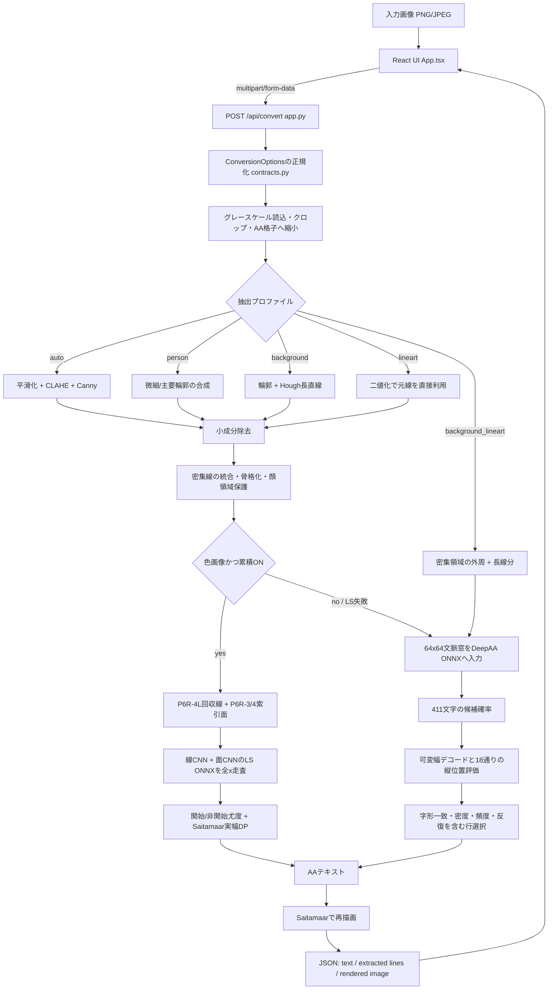

# Yaruo AA Studio 処理構造

## 1. 目的と範囲

Yaruo AA Studioは、グレースケール画像からSaitamaarの可変幅字形を使ったShift-JIS AAの下書きを生成するローカルアプリです。

設計上の中心は、単純な輝度文字置換ではなく、次の3段階を分離することです。

1. 元画像からAAに必要な線を選ぶ。
2. 線をAAセルで表現できる密度へ整理する。
3. 学習モデルと実際の字形評価を組み合わせて文字を配置する。

完成AAを意味的に描き直す生成モデルや、無修正での完成保証は現在の範囲外です。

## 2. 技術構成

| 層 | 技術 | 役割 |
| --- | --- | --- |
| 画面 | React 19、TypeScript、Vite | 入力、設定、結果比較、テキスト編集 |
| HTTP API | FastAPI、Uvicorn | 画像と設定の受け取り、変換結果の返却 |
| 画像処理 | OpenCV、NumPy、Pillow | クロップ、縮小、輪郭抽出、デフォルメ、レンダリング |
| 推論 | ONNX Runtime | DeepAA軽量CNN、開始位置モデル、線・面分離LSモデルの実行 |
| 学習 | PyTorch、scikit-learn | 追加学習、開始位置モデル、実験用Random Forest |
| 配布 | PyInstaller | Windowsポータブル版の作成 |

推論はCPU上のONNX Runtimeで完結し、変換時に画像を外部サービスへ送信しません。

## 3. ディレクトリと責務

```text
image2aa/
├─ backend/
│  ├─ app.py          HTTP APIとフロントエンド配信
│  ├─ cli.py          バッチ変換CLI
│  ├─ correction_pairs.py 修正対応対の不変保存、ハッシュ検証、拡張
│  ├─ draft_preferences.py 複数草案と人手選択の不変保存・ハッシュ検証
│  ├─ surface_fill.py 同一基準AAからの面制約付き塗り4案生成
│  ├─ surface_fill_preferences.py 塗り4案と選択のv2不変保存・ハッシュ検証
│  ├─ surface_recovery.py 低コントラスト線・境界暗部面の回収4案
│  ├─ contracts.py    変換オプションと結果の共通データ型
│  ├─ deepaa.py       DeepAA前処理、推論、デコード、再描画
│  ├─ deepaa_surface.py 線・面分離LSの密走査と開始/実幅DP
│  ├─ surface_channels.py 学習・実画像で共有する線/面入力契約
│  ├─ image_io.py     画像読込とPNG Data URL変換
│  ├─ rendering.py    Saitamaarフォントと字形描画
│  ├─ surface_decisions.py 修正AA面対応と規則ベース塗り判定
│  ├─ surface_proposals.py 色領域・線画閉領域の候補面と共通属性
│  └─ desktop.py      ポータブル版起動処理
├─ frontend/src/
│  └─ App.tsx         画面状態、設定、API呼び出し、AA編集
├─ models/
│  ├─ deepaa-light.onnx          411文字分類モデル
│  ├─ deepaa-start-locator.onnx  文字開始位置モデル
│  ├─ deepaa-charset.csv         分類出力と411文字の対応表
│  ├─ deepaa-surface-v0-ls.onnx  線・面分離1,187文字モデル
│  └─ deepaa-surface-v0-vocabulary.json LS出力文字と元checkpoint
├─ datasets/bootstrap/           DeepAA由来データのローカル配置先、ライセンス、来歴（データ本体はGit対象外）
├─ datasets/incoming/yaruyomi/   Git対象外のMLT原本・索引・レビューDB
├─ datasets/incoming/correction-pairs/ Git対象外の元画像・草案・人手修正AA対応対
├─ datasets/incoming/draft-preferences/ Git対象外の複数草案・選択・全案不採用記録
├─ assets/fonts/                  実行時に使うAA表示フォント
├─ samples/                       CLI・固定評価で使うローカル入力例（画像はGit対象外）
├─ training/                      データ再構成と追加学習コード
├─ evaluation/                    固定ケースと品質評価
├─ tests/                         単体・統合テスト
├─ docs/                          操作・設計・リリース資料
├─ run.ps1                        ビルド済み画面の通常起動
└─ start.ps1                      フロントエンド開発サーバー起動
```

## 4. 実行時データフロー



## 5. API境界

### `POST /api/convert`

`multipart/form-data` で画像と設定を受け取ります。主要フィールドは次のとおりです。

| フィールド | 型 | API既定値 | 正規化範囲 |
| --- | --- | ---: | --- |
| `image` | file | 必須 | 画像、最大20MB |
| `profile` | string | `auto` | `auto` / `person` / `background` / `lineart` / `background_lineart` |
| `columns` | int | 72 | 24～140 |
| `detail` | int | 72 | 0～100 |
| `abstraction` | int | 35 | 0～100 |
| `threshold_low` | int | 45 | 0～254 |
| `threshold_high` | int | 135 | 下限+1～255 |
| `min_component` | int | 8 | 0～200 |
| `max_rows` | int | 64 | 12～100 |
| `crop_x`, `crop_y` | float | 0 | 画像内へ制限 |
| `crop_width`, `crop_height` | float | 1 | 最低0.05、画像内へ制限 |

画面側の初期値は用途に合わせて一部異なり、`App.tsx` の `defaults` と各プリセットが正です。

応答は次の形です。

```json
{
  "ascii": "生成されたAAテキスト",
  "rows": 42,
  "columns": 72,
  "processedPng": "data:image/png;base64,...",
  "renderedPng": "data:image/png;base64,...",
  "crop": [100, 5, 420, 500],
  "options": {"columns": 72, "font_size": 16, "profile": "person"}
}
```

`processedPng` はDeepAAへ渡した白地黒線画像、`renderedPng` は生成文字をSaitamaarで再描画した画像です。`options`は受信値ではなく、値域とクロップ比を正規化した後に実際の変換へ使った全`ConversionOptions`です。

`POST /api/convert`は`cumulative=true`を既定値とし、色画像では`deepaa-surface-v0-ls` / `deepaa-surface-v0-provisional-v1`を実行します。P6R-4L回収線と、P6R-3/4で選択したLab面のmembership・ID-boundary・source-darkness toneを別CNNへ入力します。16位相shift-and-stitchで全xの文字・開始logitを求め、選んだ文字開始ではstart尤度、字幅内部ではnon-start尤度を課すSaitamaar実幅DPで、正解文字数なしに各行を指定幅へ合わせます。LS出力へ旧面塗り・情報回収・T3を再適用はしません。モデル/推論エラー、実幅不一致、非空入力行の全空白化では`p6r-cumulative-g1-v1`全体へfallbackします。`pipeline`はLS ONNX・語彙・元checkpointのハッシュとfallback来歴を返します。`cumulative=false`は旧DeepAAの比較・再現経路です。`lineart`と`background_lineart`はtone面を持たないため、累積指定時もP6R-G1の線画経路を使います。

### 修正対応対API

`POST /api/correction-pairs`は、元画像、`POST /api/convert`が返した正規化設定と実クロップ、抽出線、草案AA、編集後AA、草案再描画をmultipartで受け取ります。`backend.correction_pairs.CorrectionPairStore`は修正後再描画と文字差分を生成し、Git対象外の`datasets/incoming/correction-pairs/v1/<record-id>/`へ原子的に保存します。草案と修正AAが同一の提出は拒否します。

`record.json`は元画像・生成資産・全artifact・座標変換・文字差分・生成recipeと段階別来歴を含むスキーマ版1の不変manifestです。artifactのbyte数とSHA-256に加えてmanifest自身もSHA-256で検証します。同一内容は決定的なrecord IDになるため再保存しても既存記録を返します。旧記録はgeneration未指定のlegacyとして読み込めます。`extensions.json`だけは別revisionと内容ハッシュを持ち、P6R-3/4向けの候補面、面対応、面指標をベース記録を変えずに原子的に追記できます。草案再生成照合は保存recipeに応じて旧DeepAA、P6R-G1、LS暫定生成器を使い分け、LS記録はONNXと語彙も生成資産として固定します。

- `GET /api/correction-pairs`: 記録一覧
- `GET /api/correction-pairs/{record_id}`: ハッシュ検証済み記録
- `GET /api/correction-pairs/{record_id}/assets/{asset_name}`: 登録済みartifact
- `PATCH /api/correction-pairs/{record_id}/extensions`: 予約済み面スロットの更新
- `POST /api/correction-pairs/{record_id}/verify`: 同じ入力と設定による草案再生成照合
- `POST /api/correction-pairs/{record_id}/surface-analysis`: 候補面、修正AA面対応、規則ベース指標の三拡張を一回で保存

座標変換は元画像サイズ、実クロップbox、AAキャンバスサイズ、順逆のscale/offset、Saitamaarフォントサイズと行送りを保存します。正解面IoUはこの保存だけでは発生せず、P6R-3/4で同じ記録へ対応ID付き面データを追加して初めて評価します。詳細は[P6R-2S資料](CORRECTION_PAIRS_P6R2S.md)を参照してください。

### 保存済み比較・再現API

完了したv2～v4比較収集の3ボタンと候補選択UIは通常のReact画面から撤去した。次のAPIと保存済み記録は、実験の再現・検証用として維持する。`POST /api/surface-fill-comparison`はDeepAA/Beam基準AAを一回だけ生成し、全案で抽出線、クロップ、設定、行幅を共有する。`surface-fill-v2`は無塗りと、同じ`lab-l4-a4-b4`候補面をscore 0.30で選んだ保守・標準・拡張の3配置案である。クロップ内の有効画素からグレースケールP10/P90を計算し、各面の相対的な暗さをdark / middle / lightへ分ける。境界1px・3文字以上を共通にし、相対的に暗い面ほどセル面被覆と安全域を緩める。拡張案も構造許容量は標準案と同じ8/6/4%に固定し、線損失を抑える。各条件には版付きの`variant_id`を付け、元画像内容の安定ハッシュ順で候補A～Dへ割り当てる。

`POST /api/surface-fill-preferences`は、元画像、比較・生成器・recipe版、共通の正規化設定・実クロップ・抽出線、各候補のAA・再描画・塗り面マスク・面判断・置換診断と、「1案を選択」または「全案不採用」のどちらか一方を受け取ります。`backend.surface_fill_preferences.SurfaceFillPreferenceStore`は全artifactとmanifestのSHA-256を検証できるスキーマ版2の不変記録を`datasets/incoming/draft-preferences/v2/<record-id>/`へ原子的に保存します。同一内容は決定的IDで冪等保存し、`GET /api/surface-fill-preferences`で検証済み記録を列挙します。線画プロファイルはtoneなしとして生成・保存とも拒否します。

`POST /api/surface-recovery-comparison`はP6R-4L用に、現行、局所コントラスト線回収、境界暗部面回収、併用の4案を返します。候補ごとに抽出線が異なるため、`POST /api/surface-recovery-preferences`はprocessed画像も候補別artifactとしてスキーマ版3で`datasets/incoming/draft-preferences/v3/<record-id>/`へ保存します。`GET /api/surface-recovery-preferences`は検証済みv3記録を列挙します。v2とは別root・別comparison kindであり、相互に上書きしません。

`POST /api/information-recovery-comparison`はP6R-4I用です。アップロード画像のSHA-256と全正規化設定が一致する選択済みv3記録を一つだけ要求し、その選択候補を基準に、未選択濃淡面、選択面内配置、併用の回収案を作ります。元画像根拠のある空白セルだけを3セル以上の4近傍成分として扱い、可変幅文字区間を同じSaitamaar字幅の句読点反復＋余白へ置換します。`POST /api/information-recovery-preferences`は全候補と診断をスキーマ版4で`datasets/incoming/draft-preferences/v4/<record-id>/`へ保存し、`GET /api/information-recovery-preferences`で検証済み記録を列挙します。

旧line設定4案の`POST /api/draft-preferences`、そのv1保存物、初回`surface-fill-v1`の3件も残すが、v2～v4と同様に現在のUIからは収集しない。

この選好記録は、修正済みAAを正解とする`correction_pair`ではありません。低負担な候補順位・全案不採用の信号として先に蓄積し、厳密な文字差分やP6R-4面指標が必要な例だけ修正対応対へ進めます。

P6R-4T3の完了済み一時評価では、`POST /api/surface-texture-proximity-comparison`が選択済みv2または代替v4を基準にし、区切り線基準T2と近接距離基準T3を決定的な盲検順で返します。`POST /api/surface-texture-proximity-preferences`は2候補と、A/B選択、差なし、両方不採用をスキーマ版6として`datasets/incoming/draft-preferences/v6/`へ保存します。v5の`POST /api/surface-texture-comparison`、`POST /api/surface-texture-preferences`、保存記録も再現用に維持します。ReactのA/B収集UIは撤去済みです。T3の実装は正式品質合格ではないまま、現在の限定的効果を保持する暫定段として累積通常生成へ接続し、安全条件を外れた場合は直前段へ戻します。

### `POST /api/text/cp932-ncr`

画面で編集中のUnicode文字列を、MLTなどの旧来CP932テキストへ渡せる表現に変換します。CP932で表現できる文字はそのまま残し、表現できない文字だけを10進数値文字参照へ変換します。通常表示、通常コピー、UTF-8 TXT保存ではこの変換を行いません。これはHTMLエスケープAPIではないため、HTMLソースへ埋め込む際の`&`や`<`の処理は呼び出し側が別途行います。

```json
{"text": "～∥█", "encoding": "cp932-ncr"}
```

```json
{"text": "～∥&#9608;", "encoding": "cp932-ncr"}
```

## 6. 共通データ型

### `ConversionOptions`

UI、API、CLIから渡された変換条件をまとめます。`normalized()` が値域とプロファイルを検証するため、変換本体は正規化済みの値を前提にできます。

### `ConversionResult`

AAテキスト、行数、桁数、前処理画像、再描画画像、実際のクロップ座標を返します。Web APIとCLIは同じ変換結果を利用します。

### `DeepAAAssets`

ONNXセッション、411文字の辞書、学習データ上の文字頻度、Saitamaar字形マスクをまとめ、プロセス内でキャッシュします。

## 7. 前処理

実装位置は `backend/deepaa.py` の `preprocess_for_deepaa()` です。

### 7.1 サイズ決定

- Saitamaar基準フォント高: 16px
- 行ピッチ: 18px
- 半角セル幅: 8px
- 目標画像幅: `columns × 8px`
- 目標画像高: 元の縦横比から計算し、18px単位へ丸め、`max_rows` で制限

これにより、前処理画像と最終的な字形配置が同じ座標系を使います。

### 7.2 プロファイル別抽出

| プロファイル | 処理 |
| --- | --- |
| `auto` | Gaussian Blur → CLAHE → Canny → 小成分除去 |
| `person` | 弱い平滑化とCLAHEの後、微細Cannyと粗いCannyをOR合成 |
| `background` | Cannyと構造用Cannyを合成し、確率的Hough変換で長直線を補強 |
| `lineart` | グレースケールしきい値で黒線を直接抽出し、小成分を除去 |
| `background_lineart` | 黒線を直接抽出した後、密集線の外周とLSDによる長線分を合成 |

`lineart` 以外で細部が75未満なら、3×3のクロスカーネルによるClosingで短い線切れを接続します。

### 7.3 P1共通入力抽出`X`

次期モデル用の共通入力抽出は`backend/input_channels.py`に置き、学習時と推論時が同じ関数を呼べる構造にします。入力を一度だけ512px幅へリサイズし、高さを18px行送りへ揃えてから次の3チャンネルを同一座標で生成します。

- `ch0 structure`: 実グレースケールはLaplacian、線画・AA構造代理画像は黒線反転を初期信号とし、共通の二値化、線切れ接続、小成分除去、骨格化で1px線へ正規化する。
- `ch1 tone`: 反転グレースケールを48×54pxのBox Filter、sigma 12のGaussian Blurへ通し、4段階へ量子化する。AA側も構造代理画像を経由せずAAラスタから直接作る。
- `ch2 fill`: 暗部しきい値から侵食seedと制約付き膨張再構成を作り、小物体・小穴を除去する。太い核につながった細線へ再構成が漏れないよう、核から侵食半径内の支持領域へ限定する。

`training.prepare_reference_channels`は、権利情報付きのローカルマニフェストと画像を読み、各チャンネル、NPZ、被覆率、濃度分布、層化状況を`.tmp/input-channels/`へ保存します。4固定サンプルによるpilotは実装確認用で、P1ゲートは人物・背景、原画・線画、写真・イラスト・線画、濃淡3層を含む30～50枚です。2026-08-25のローカル参照集合は人物16枚・背景14枚、原画15枚・線画15枚の計30枚で全層を満たしました。原画と線画は独立したドメイン参照であり、同一内容の正解対応対とは扱いません。この集合はドメイン診断用で、学習可否を自動的には与えません。

### 7.4 P2構造代理画像`E`

`training.structure_proxy`は、Saitamaarの生AAラスタと、4倍描画・高解像度ブラー・同一キャンバス縮小の二候補を生成します。どちらも本当の元画像を推定する処理ではなく、`aa_proxy`として共通`X`へ渡す構造代理画像です。

`training.evaluate_structure_proxies`は、P1参照30枚と`accepted-v1`から層化選択したAA30件を使い、入力寸法を含めない画像レベル記述子の反復cross-validationでドメインAUCを測ります。芯線Chamferは、生AAラスタを共通`X`へ通した`ch0`を基準に、候補変換による構造変位だけを測ります。2026-08-26の基準実行は、生ラスタAUC 0.950・Chamfer 0px、4倍候補AUC 0.940・Chamfer平均0.919pxで、両AUCの95%区間は大きく重なりました。これは診断用二軸であり、P3の下流文字accuracyなしに候補を決めません。

### 7.5 P3線1ch下流確認

`training.structure_proxy_dataset`は、`accepted-v1`のAA本文、Saitamaar advance、固定MLT splitから、各`E`候補の共通`ch0`画像と正解文字開始座標を生成します。512px正規化後の座標衝突を検査し、411語彙外文字を別集計します。

`training.train_structure_proxy_p3`は、DeepAA lightの同一初期重みから候補ごとにC=1分類器を学習し、全体、非空白、空白、Top-5、macro、旧頻度帯別accuracyを保存します。2026-08-26の100作品・226,146例による固定testでは、生ラスタ57.41%・非空白62.88%、4倍候補55.88%・60.44%でした。作品単位bootstrap区間は0をまたぎますが、4倍候補はP2・P3のいずれにも明確な利点がないため暫定混合から外し、生ラスタをP4のC=1基準にします。

### 7.6 P4塗り段1

`backend.fill_postprocess`は、実画像の`ch2`内部にある連続文字区間だけを、`accepted-v1`で20 run以上観測された塗り文字へ後処理置換します。ch2境界とch0構造セルはMの出力を保持します。Saitamaarの可変幅を壊さないよう、同じ塗り文字を3回以上反復し、必要なら区間端の空白で調整して、置換区間と各行のadvance総和を完全一致させます。

`training.evaluate_fill_stage1`は4固定ケースの変更前後と診断画像を生成し、`training.tune_fill_stage1`は内部率、境界余白、構造保護を32条件で比較します。共通選択設定は人物・背景の主要線損失を1.35%以下、ch2外追加を0.69%以下、線画の置換を0に抑えました。しかし人物の黒髪・暗い服・カーテンを同じ`;`の水平帯として扱い、髪の流れと黒目を表現できなかったため、段1単独は実行時既定へ採用しません。実装と結果は[P4資料](FILL_STAGE1_P4.md)に固定し、P6のC=2/3比較の下限として保持します。

### 7.7 P5構造augmentとch1診断

`training.structure_augment`は、生AAラスタへ座標を動かさない弱いGaussian、JPEG Q85、90%縮小往復、1px太線化を適用し、重み付き混合を定義します。線のランダム欠落は含めません。`training.evaluate_structure_augment_p5`は同じAA作品の全派生を同一foldへ束ねたgroup AUCとChamferを測り、`training.train_structure_augment_p5`はtrainだけに混合を入れてP3と同じ生ラスタtestを評価します。

1px太線化は1作品でChamfer 13.23pxとなったため除外しました。弱い描画劣化50%混合はAUCを0.956から0.901へ下げ、P3生ラスタ比のtest差を全体−0.116pt、非空白−0.048ptに保ったため、P6の暫定ch0 train混合にします。

`training.evaluate_tone_windows_p5`はch1だけのドメインAUC、実画像・AAの濃淡変動、AA文字リークを窓幅とgammaごとに比較します。従来W48・gamma 1.0の等間隔4段階はAA側で平均1.03段階しか使わず、ほぼ全面0でした。`ChannelExtractionConfig.tone_gamma`を量子化前の共通変換として追加し、既存再現用の既定値は1.0のまま維持します。P6第一候補はW48×H54、sigma 12、gamma 0.5、4段階で、W64・W80もC=2比較へ残します。詳細は[P5資料](STRUCTURE_AUGMENT_P5.md)に固定します。

### 7.8 P6線＋濃度2ch

`training.multichannel_dataset`は、trainのch0だけへP5の`processing_50`を適用し、ch1は生AAラスタから作ります。AA本文の同一文字反復位置を文字例へ付け、`training.train_multichannel_p6`がC1とW48/W64/W80のC2を全体・非空白・頻度帯・塗りrun内外で比較します。第一層のch0へC1重みを完全コピーし、ch1重みを0で初期化するため、学習前C2はC1とbit一致します。

W48は合成testの塗りrun内accuracyを+1.339pt改善しましたが、`training.evaluate_multichannel_p6`の固定人物原画では反復塗りが19文字から2,428文字へ増えました。AA trainのch1は4段階中0/1しか使わず、人物・背景原画はほぼ2/3しか使っていませんでした。trainへ無関係な広域toneを混ぜるP6bは暴走を止めた一方、塗り改善と人物の必要線を失いました。現行C2は実行時へ接続しません。2026-08-27の横断レビューで、共通toneの値域再校正では意味の不一致を解消できないと判断し、P6.1と画素`ch1`入力経路を終了しました。詳細は[P6資料](MULTICHANNEL_P6.md)に固定します。

P3〜P6はすべて実装・測定済みですが、品質改善として採用したモデル、augment、後処理はありません。P3生ラスタC1は歴史的なDeepAA比較基準に限ります。P4〜P6は塗りを面IDへ索引化せず画素マスク・濃度チャンネルで解こうとした不適切な問題設定なので、再現物は監査履歴としてだけ保持し、現行アーキテクチャ、accepted-v2逆生成方式、パラメータ、棄却判断の根拠には使いません。

### 7.9 P6R 面単位への変更

次の塗り経路は、画素ch1/ch2をそのまま文字分類器へ積む構成ではなく、線、面、字形候補、配置を分けます。

| 記号 | 役割 |
| --- | --- |
| `S_line` | 実画像から主要線を抽出する。現行ch0とプロファイル別前処理を比較基準にする。 |
| `G` | イラストの色領域または線画の閉領域から候補面を提案する。候補であり塗り確定ではない。 |
| `H` | 面の色・濃度・形状・位置・周囲線を使い、塗り有無と濃淡段階を決める。 |
| `M` | 線構造に対する文字候補と開始位置を提案する。 |
| `D` | Saitamaarの可変幅、面境界、線保持、接続を制約にして最終AAを配置する。 |

AA側では`detect_fill_runs()`の水平runを、`connect_fill_runs()`が隣接行かつ短い側の25%以上の水平重なりで`FillSurface`へ連結します。面は入力順に依存しないID、run集合、可変幅X座標、整数マスク境界、面積、外接矩形、行数、文字・濃度構成を持ちます。`render_fill_surface_labels()`は面IDマスクを作り、`training.analyze_aa_fill_surfaces`がaccepted-v1全100件を集計します。

P6R-1の固定実行では2,535 runから656面を得て、2,347 run（92.584%）が複数行面へ入りました。複数行面468、孤立1行面188、反復runあり78作品のうち72作品に複数行面があり、全件で面マスク画素数と面積集計が一致しました。停止条件には該当せず合格です。ただし反復runは塗り面の正例だけなので、非塗り面を学習するにはAAラスタの全候補面または元画像・人手修正AA対応対が必要です。詳細は[P6R-1資料](AA_FILL_SURFACES_P6R1.md)に固定します。

実画像側は既存`decode_image()`のグレースケール契約を保ったまま、色保持読込を別経路として追加します。線画のClosingは変換用の元線へ掛けず、閉領域検出専用バッファだけへ適用します。濃淡を捨てず、面ごとの色・濃度統計として`H`へ渡します。

面IoU、過剰塗り、欠落塗りは同一座標の正解面がある場合だけ計算します。P1参照30枚と`accepted-v1` 100作品は未対応集合なので、面数・面積・位置分布の診断には使えますが、正しさのIoUには使いません。詳細なフェーズと停止条件は[P1〜P6方向性レビュー](P1_P6_DIRECTION_REVIEW.md)を参照してください。

`evaluation.surface_metrics`は0を背景とする整数面ラベル、`coordinate_space_id`、`correspondence_id`を`SurfaceSet`へまとめます。正解評価は両IDとマスク形状が一致する場合だけ許可し、未対応集合は`UnpairedSurfaceEvaluationError`で拒否します。IoU 0.5以上の候補を決定的一対一対応し、面precision/recall、過剰、欠落、画素IoUを返します。小さい側の面積に対する重なり10%以上のグラフからsplit/mergeを別集計し、任意の線マスクが両側にある場合は正解面内の1px近傍線保持率と損失も返します。

`training.evaluate_surface_metrics_p6r2`は完全一致・過剰・欠落・split・mergeの合成ケースとaccepted-v1全100件を固定確認します。656面の自己回帰は100件すべて一致し、対応IDなしの評価は100件すべて拒否したためP6R-2は合格です。これは評価契約の回帰であり、未対応実画像の正しさを示しません。結果は[P6R-2資料](SURFACE_METRICS_P6R2.md)に固定します。

P6R-2で面指標と座標契約を確定した直後に、修正対応対の保存基盤P6R-2Sを前倒しします。元画像ハッシュ・来歴、クロップ、全設定、抽出線、草案AA、修正AA、再描画、座標変換、文字差分をスキーマ版付きで保存・再読込し、P6R-3以降の候補面と面対応を同じ記録へ追記できる構造にします。

P6R-3の`backend.surface_proposals`は、既存`decode_image()`を変えず`decode_color_image()`から8-bit BGRを受け取ります。原画はOpenCV Labを`4×4×4`と`6×6×6`へ量子化した連結領域、線画は元線とは別の検出bufferだけを3px / 5px Closingした閉領域を候補にします。画像外周へ接続する白領域は外部背景として候補から除き、面積率を診断へ残します。

両方式は背景0の整数ラベル、面積・形状・外周接触、輝度統計、色統計、周辺差、同一層隣接、粒度間overlap / split / mergeを共通`SurfaceProposal`へ正規化します。ラベルはハッシュと決定的な行spanで保存できます。通常診断は幅512px・18px行送りのP1座標を使い、修正対応対では保存済み実クロップとAAキャンバス寸法を指定して同じ座標へ合わせます。

P1参照30件では全件に候補があり、主要な色面・閉領域と外部背景除外を目視確認したため条件付き合格です。写真の断片化、淡色面の融合、開いた輪郭の欠落はP6R-4で候補面と修正AA面を対応させて評価します。P1と`accepted-v1`は未対応なので、この診断から正解IoU、過剰、欠落を出しません。詳細は[P6R-3資料](SURFACE_PROPOSALS_P6R3.md)に固定します。

P6R-4の`backend.surface_decisions`は、P6R-2S記録の実クロップをAAキャンバス寸法へ直接変換し、P6R-3候補と修正AAのP6R-1反復塗り面を同じ座標へ置きます。候補と正解面の全重なり、規則ベースv1の`fill` / `reject` / `abstain`、P6R-2面指標を三拡張スロットへ一回で保存します。色候補は暗さ、符号付き周辺輝度差、Lab差、形状、外周・広域減点だけを使い、線画はtone欠損としてabstainします。

`training.evaluate_surface_decisions_p6r4`は全記録を読取集計し、明示指定時だけ拡張を書きます。2026-08-28時点は実修正対0件なので、合成対は契約回帰に限定し、品質ゲートは`null`です。同一対C1比較と面制約付きAA配置後の線損失はまだこの基盤に含みません。詳細は[P6R-4資料](SURFACE_DECISIONS_P6R4.md)に固定します。

## 8. 適応的デフォルメ

実装位置は `backend/deepaa.py` の `_abstract_linework()` です。

処理順は次のとおりです。

1. UIのデフォルメ値へプロファイル係数を掛けます。
2. 線画像をぼかし、近い細線を同じ白領域へ結合します。
3. 強度が一定以上なら3×3楕円カーネルでClosingします。
4. Zhang-Suen法で結合領域を1pxの代表線へ骨格化します。
5. 強度に応じて短い連結成分を除去します。
6. 人物・線画では、想定顔領域内だけ元の線を戻します。

プロファイル係数は次のとおりです。

| プロファイル | 係数 |
| --- | ---: |
| `lineart` | 1.00 |
| `person` | 0.85 |
| `auto` | 0.65 |
| `background` | 0.25 |

背景の係数を小さくしているのは、屋根や建物の平行線、遠近線を過剰に統合しないためです。

係数適用後の強度が0.04未満なら処理を行いません。そのため、背景プロファイルのUI既定値15は `0.15 × 0.25 = 0.0375` となり、現在は実質無効です。背景でデフォルメを有効にする境界は17です。

顔保護は、処理画像の幅50%、高さ40%を中心とし、横半径24%、縦半径18%の楕円です。これは顔検出やセマンティックセグメンテーションではありません。将来、複数人物や自由構図へ対応する場合は、この規則を顔ランドマークまたは領域推定へ置き換える必要があります。

### 背景線画の専用処理

`background_lineart` は人物用の骨格化と顔保護を使いません。密集線をぼかして結合した後、その領域の外周をCannyで取り出します。さらにOpenCVのLine Segment Detectorで元画像から一定長以上の直線を検出し、屋根、壁、柱、遠近線などを構造画像へ戻します。これにより、密集領域の中央に偽の網目を作らず、建築の外形を優先します。

背景線画では文字多様性補正を60%、行内反復ペナルティを弱く適用します。通常の背景写真プロファイルは長直線の連続表現を優先するため、これらを無効のまま維持します。

## 9. DeepAA推論

### 9.1 入力と文字辞書

- モデル: `models/deepaa-light.onnx`
- 入力文脈: 64×64px、グレースケール1チャネル
- 出力: 411文字の確率
- 文字辞書: `models/deepaa-charset.csv`
- 字形評価: `assets/fonts/Saitamaar.ttf`を16pxでラスタライズ

モデルの由来、ハッシュ、開始位置モデルの固定評価値は `models/README.md` に記録します。

各行の現在位置から64×64の文脈窓を切り出して文字を推論し、選んだ文字の実幅だけX座標を進めます。そのため、固定8px区切りの分類ではなく、半角・全角を含む可変幅列を生成できます。

### 9.2 縦位置

行ピッチ18pxに対して0～17pxの全オフセットを試し、生成した字形と抽出線の距離コストが最小になる位置を選びます。これにより、目や輪郭が行境界へ不利にまたがる問題を軽減します。

### 9.3 デコーダ

| デコーダ | 用途 | 概要 |
| --- | --- | --- |
| `beam` | 通常利用 | 複数の可変幅候補を保持し、行ごとの再描画コストで選択 |
| `viterbi` | 品質実験 | 全幅のDP探索候補と基準結果を比較 |
| `viterbi-pruned` | 品質実験 | 開始位置モデルで探索点を絞ったDP |

最終候補はモデル確率だけで決めません。次の評価を組み合わせます。

- DeepAAの文字確率
- 学習データ中の文字頻度に対する弱い事前確率補正
- 抽出線と実際のSaitamaar字形の局所形状差
- 元線より過剰に濃い字形への密度ペナルティ
- 同一文字の過剰な連続への反復ペナルティ
- 行全体を再描画したときの双方向距離コスト
- 任意指定の線方向・境界接続コスト（実験機能）

人物・線画では文字多様性と反復抑制を有効にし、背景では長直線を同じ文字で連続表現できるよう抑制を弱めます。

分類器は既定のDeepAA CNNに加え、学習時のみscikit-learnを使うRandom Forestを実験的に選択できます。Random Forestは配布モデルへ含めず、通常の変換経路も変更しません。4サンプル比較ではCNNを上回らなかったため、置き換え候補ではなく比較用実装として保持しています。条件と結果は `RANDOM_FOREST_EXPERIMENT.md` に記録します。

## 10. 学習データと追加学習

ローカル専用の`datasets/bootstrap/deepaa-500.csv`には、DeepAA由来の500作品の文字、座標、ラベルがあります。第三者AA本文を含むためGitには収録しません。`training.reconstruct_dataset`は、ファイルがローカルに配置されている場合だけSaitamaar字形を座標どおり配置し、正解AA画像とテキストを再構成します。出典、固定リビジョン、ハッシュ、配置方法は同ディレクトリの`PROVENANCE.md`に固定します。

`training.verify_renderer`はP0の独立逆検証です。CSV座標から各文字を直接描く経路と、ラベル列からadvanceを再計算して文字列を一括描画する経路を比較し、モデル対象ラベルと文字の対応、18px行送り、PillowとWindows GDIの右端も照合します。旧グリフ合成はadvance幅を越えるインクを切っていたため廃止し、正本レンダラは行単位の文字列描画に統一します。

やる夫AA録2の完成AA候補は`training.import_yaruyomi`で`index.sqlite3`へ索引化します。文字参照を含む原本本文から出典用SHA-256を計算し、参照をUnicodeへ復元した本文から分類、寸法、プレビューを計算します。レビューAPIも原本ZIPからチャンクを復元してハッシュを検証した後、Unicode本文をReact画面へ返します。採否、修正カテゴリ、完成度、問題タグ、コメントは別の`reviews.sqlite3`へ原本の正規化本文SHA-256を主キーとして保存します。索引IDや表示用変換後の文字列だけへ依存しないため、同一AAの重複提示を避け、索引再構築後も評価を引き継げます。

採用100件到達時点は`training.freeze_review_corpus`で`accepted-v1`へ固定します。全317件をUnicode本文と来歴付きで保存し、採用100件だけをsource MLT単位で80/10/10へ分割します。`training.audit_review_snapshot`が本文ハッシュ、空白差・小差分・左右反転近似、split漏洩を検査します。

`training.generate_weak_pairs`は採用AAをSaitamaarで再描画し、細線化、輪郭、簡略化、部分欠落の4候補を生成します。これは実在元画像との`gold_pair`ではなく、方式・設定・seedを固定した`weak_pair`です。`training.train_quality_ranker`は採否317件から本文構造の比較基準を学習しますが、source MLT holdoutの性能が低いため実行時APIへは読み込みません。

初回評価後の`training.generate_weak_pairs_v2`は同じ20作品を保ち、細線化基準、細かい局所インク密度、文字・行ピッチより広い粗い密度、5段階の塗り、粗い密度と面輪郭、変形後の密度と面輪郭の6候補を生成します。高周波の字形だけでなく低周波の塗り・陰影を別信号として扱い、脱文字のために濃い面を消しません。表示順は作品IDと方式名のハッシュで決定的に並べ替え、画面には方式名を出しません。内部の方式ID、設定、seed、画像ハッシュは引き続き`pairs.jsonl`に残るため、ブラインド評価と再現性を両立します。

20作品・120候補の評価では、細線化はAA字形をそのまま残し、残る5方式は字形抑制を強めるほど構造と塗りを失いました。相対最良の細かい局所インク密度も強いぼかしを避けられず、全方式を1枚の画像・AA対応教師として不採用にしました。weak-v1/v2の生成物と評価DBは失敗実験の監査用に保持します。ただし、この結果は`E`をch0だけに使い、ch1をAAラスタから直接作る多チャンネル学習の不採用根拠にはしません。

weak-v1の`dropout`は全20件で線品質平均3.95でしたが、後続確認で必要線もランダムに欠落すると判明したため、実処理には採用しません。線と塗りの分離は画像密度から推測せず、完成AA本文にある同一文字反復を利用します。`training.aa_fill_layers`は`.`、`:`、`;`などの反復を塗り、罫線・格子・斜線を線として扱い、Saitamaarの実文字幅を保った二つの補助ラベルを生成します。

`dropout`線の下へ別方式の濃淡・塗りを合成する6作品プレビューも試しましたが、局所文字密度から意味上の塗り領域は復元できず、線側では必要線も欠落しました。線を塗り境界にする案も文字単位の白抜きを強めたため不採用です。実験用の比較UI、API、生成コードは現行構造から削除し、画像条件付き処理は実元画像の線とグレースケールを直接使います。

反復塗り解析を`accepted-v1`全100作品へ適用した結果、78作品で検出され、22作品では検出されませんでした。検出例の目視では人物の衣服・髪・影、背景の面、エフェクトの濃淡を拾い、長い罫線と格子は除外できています。一方、複数文字を混ぜた網掛けは対象外です。このラベルは多チャンネル自己教師と実在・生成元画像の直接対応対の両方で、線一致と面濃淡を別損失にするために使います。

デコーダ側の同一文字反復コストも一律適用をやめました。線文字の不自然な連打には従来の抑制を残しますが、コーパスで塗りに使われた句読点・濃淡文字には反復罰を掛けません。塗りを出すには、次段階で実入力の低周波グレースケールを別チャンネルとしてデコーダへ渡し、反復塗りラベルとの濃淡一致を評価します。

weak-v1/v2のブラインド評価は完了し、両経路とも不採用になりました。現役のReactレビュー画面、`/api/weak-review/*`、保存実装、専用集計コマンドは2026-09-02に削除しました。生成物、評価DB、結果文書、P3〜P6の再現に必要な共通生成ヘルパーは、不採用判断の監査証拠としてローカルに保持します。

作品単位でtrain/validation/testへ分割するため、同じ作品の文字が複数splitへ漏れません。詳細なコマンドは `training/README.md` を参照してください。

現在の追加学習系は次の3課題を扱います。

1. 64×64文脈から411文字を分類する。
2. 行内の各X座標が文字開始位置かを推定する。
3. 同じ64×64文脈をRandom Forestで分類し、CNNとの性質差を比較する。

再構成画像は「正解AAをレンダリングした画像」であり、自然な元イラストとの対ではありません。weak-v1/v2で不採用になった輪郭劣化・変形は1ch候補です。P6までは`E`をch0だけに使い、ch1をAAラスタから作る`C=1→2`を比較しましたが、合成testの改善が実画像の誤塗りを予測しませんでした。以後は反復runをAA塗り面へまとめ、実画像の候補面、面属性、塗り判定を別要素として扱います。実画像への汎化と面の正誤は、利用条件を確認した実在元画像または管理された生成元画像と、人手修正版AAの対応対で評価します。

## 11. 評価

`evaluation/cases.json` が固定入力と設定を保持し、`python -m evaluation.run` が結果を `output/evaluation-baseline` へ保存します。

機械評価は主に次を追跡します。

- 抽出線と再描画字形の距離コスト
- 線画素のprecision、recall、F1
- 非空白文字数と異なる文字数
- 上位2文字・10文字への集中率

デフォルメは評価対象の抽出線そのものを変えるため、F1が下がっても視認性が上がる場合があります。人物として読めるか、背景の構図が残ったかは目視受入条件と併用します。

## 12. テスト境界

| 対象 | 主なテスト |
| --- | --- |
| オプション正規化、字形描画、DeepAA変換 | `tests/test_engine.py` |
| デスクトップ起動 | `tests/test_desktop.py` |
| 評価指標と固定ケース | `tests/test_evaluation.py` |
| 学習データ再構成 | `tests/test_training_data.py` |
| 学習サンプル抽出 | `tests/test_training_examples.py` |
| AA塗り面と面指標 | `tests/test_aa_fill_layers.py`、`tests/test_surface_metrics.py` |
| 修正対応対の不変保存 | `tests/test_correction_pairs.py`、`tests/test_app.py` |
| 旧複数草案とv1選好の不変保存 | `tests/test_draft_preferences.py`、`tests/test_app.py` |
| 実画像候補面と規則ベース面判定 | `tests/test_surface_proposals.py`、`tests/test_surface_decisions.py` |
| 同一線の塗り4案、v2選好保存 | `tests/test_surface_fill.py`、`tests/test_surface_fill_preferences.py`、`tests/test_app.py` |
| 低コントラスト線・境界暗部面の回収4案、v3保存 | `tests/test_surface_recovery.py`、`tests/test_surface_fill_preferences.py`、`tests/test_app.py` |

標準確認コマンドは次のとおりです。

```powershell
.\.venv\Scripts\python.exe -m pytest -q
```

フロントエンド変更時は追加で次を実行します。

```powershell
cd frontend
npm run build
cd ..
```

## 13. 既知の設計上の制約

- 顔保護が固定楕円で、顔位置を検出していない。
- 背景線画の構造抽出は線の意味を理解せず、外周と線分長に基づくため、曲線主体の背景では情報を落としやすい。
- 前処理の線選択は規則ベースで、部位の意味を理解していない。
- DeepAA分類モデルは元の500作品由来で、現代的な多様な入力を網羅しない。
- 500作品は本番教師ではなく歴史的ベースラインであり、元画像との対応、背景カテゴリ、作者・作風の多様性が不足する。
- 411文字の候補集合と頻度は元データに依存する。
- 自動評価は可読性やキャラクター同一性を直接測定しない。
- Web UIからは実験デコーダを選択できず、CLI経由に限られる。

## 14. 改良時の判断順序

品質問題は次の順に切り分けます。

1. クロップと解像度が適切か。
2. 抽出線に必要な意味構造が残っているか。
3. デフォルメで線を消しすぎていないか、密集を残しすぎていないか。
4. 411文字候補の中に必要な字形があるか。
5. 推論候補は正しいが、デコーダのコストで落としていないか。
6. 人手修正版を学習対として追加すべき問題か。

前処理の問題と文字選択の問題を混ぜず、`processedPng` と `renderedPng` の差から担当層を特定することが重要です。
